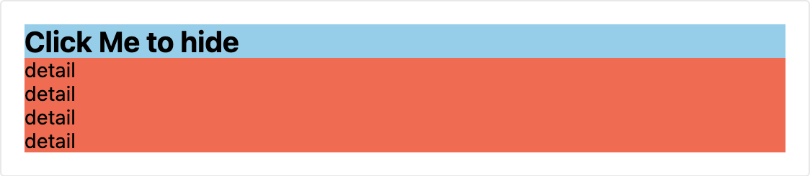
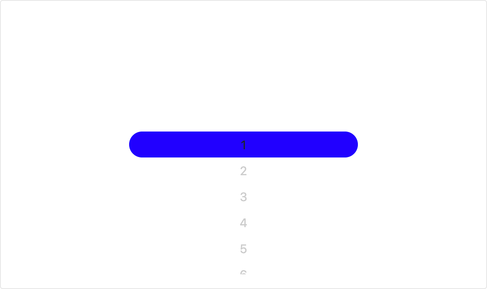
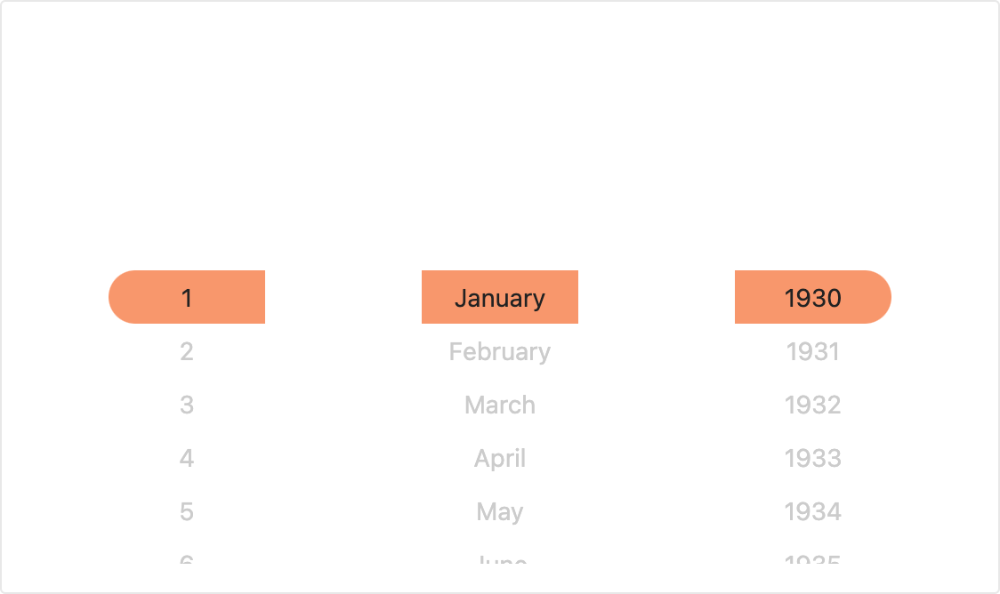
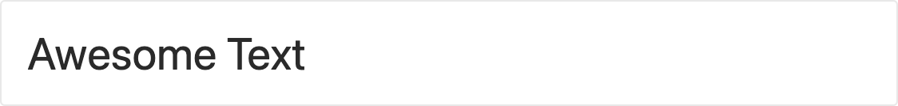

# React Native Flix Component

## Getting Started

- [Installation](#installation)
- [Documentation](https://zxccvvv.github.io/react-native-flixcomponent/) : Detail props, preview and example with **_Try It_** at `View Code`
- [Components](#components)

  | Component                     | Detail                                                                 |
  | ----------------------------- | ---------------------------------------------------------------------- |
  | [Accordion](#accordion)       | [• Usage](#images-usage) <br> [• Preview](#accordion-preview)          |
  | [Images](#images)             | [• Usage](#images-usage) <br> [• Preview](#images-preview)             |
  | [Picker](#picker)             | [• Usage](#picker-usage) <br> [• Preview](#picker-preview)             |
  | [ScrollPicker](#scrollpicker) | [• Usage](#scrollpicker-usage) <br> [• Preview](#scrollpicker-preview) |
  | [Swiper](#swiper)             | [• Usage](#swiper-usage) <br> [• Preview](#swiper-preview)             |
  | [Text](#text)                 | [• Usage](#text-usage) <br> [• Preview](#text-preview)                 |
  | [WaterDrop](#waterdrop)       | [• Usage](#waterdrop-usage) <br> [• Preview](#waterdrop-preview)       |

### Installation

```
npm install react-native-flixcomponent --save

// or using yarn

yarn add react-native-flixcomponent
```

### Components

#### Accordion

> Pure JS Accordion component with animated transition

##### Accordion Usage

```js
import React from "react";
import { Text, TouchableOpacity } from "react-native";
import { Accordion } from "FlixComponent";

export default () => {
  const [IsExpand, setIsExpand] = React.useState(false);
  return (
    <Accordion
      expanded={IsExpand}
      renderTitle={
        <TouchableOpacity onPress={() => setIsExpand(!IsExpand)}>
          <Text style={{ fontSize: 20, fontWeight: "bold" }}>
            {IsExpand ? "Click Me to hide" : "Click Me to expand"}
          </Text>
        </TouchableOpacity>
      }
    >
      <Text>detail</Text>
    </Accordion>;
  );
};
```

##### Accordion Preview



#### Images

> Pure JS Images with auto height (or width) based on ratio of an image

##### Images Usage

```js
import React from "react";
import { Images } from "FlixComponent";

export default () => {
  return (
    <Images
      source={"https://picsum.photos/400/200"}
      width={400}
      loadingWaterDrop
    />
  );
};
```

##### Images Preview


#### Picker

> Pure JS Picker with scrolling animation and customizable content

##### Picker Usage

```js
import React from "react";
import { Picker } from "FlixComponent";

export default () => {
  return (
    <Picker
      data={Array.from({ length: 10 }, (_, i) => i + 1)}
      style={{ maxHeight: 300 }}
      highlightStyle={{ backgroundColor: "blue", borderRadius: 15 }}
      onChange={(val) => console.log("read", val)}
    />
  );
};
```

##### Picker Preview



#### ScrollPicker

> Enhance Picker Component with scrolling animation and customizable content

##### ScrollPicker Usage

```js
import React from "react";
import { ScrollPicker } from "FlixComponent";

export default () => {
  return <ScrollPicker showDate style={{ maxHeight: 300 }} />;
};
```

##### ScrollPicker Preview [_on development_]



#### Swiper

> Pure JS list images with horizontal scrolling

##### Swiper Usage

```js
import React from "react";
import { Swiper } from "FlixComponent";

export default () => {
  return (
    <Swiper
      data={[
        "https://picsum.photos/500/200",
        "https://picsum.photos/500/200",
        "https://picsum.photos/500/200",
      ]}
    />
  );
};
```

##### Swiper Preview


#### Text

> Text Wrapper

##### Text Usage

```js
import React from "react";
import { Text } from "FlixComponent";

export default () => {
  return <Text fontSize={"XXL"}>Awesome Text</Text>;
};
```

##### Text Preview



#### WaterDrop

> Pure JS animated loading like water drop

##### WaterDrop Usage

```js
import React from "react";
import { WaterDrop } from "FlixComponent";

export default () => {
  return <WaterDrop size={15} />;
};
```

##### WaterDrop Preview


